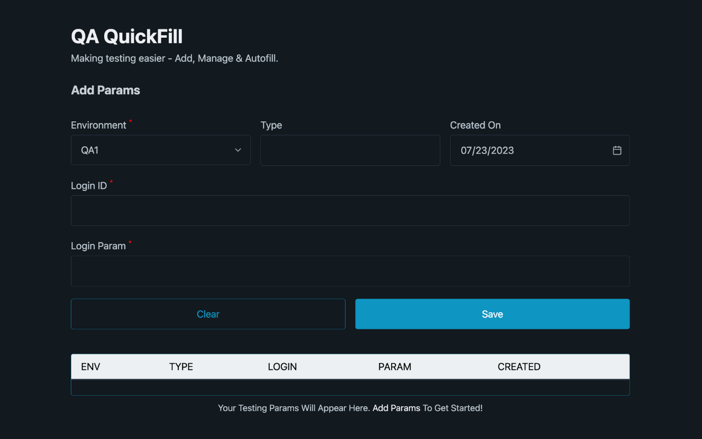

# QA QuickFill - Rapidify Manual Testing

Check out the extension here 👉 [QA Quick Fill](https://chromewebstore.google.com/detail/qa-quickfill/loaffnojpnmaceobeiibbffmdopejbpl)

## Description

QA QuickFill is a Chrome extension designed to streamline manual testing by providing a convenient solution to add, manage, and autofill QA parameters. The extension acts as a virtual diary, enabling users to effortlessly access test accounts based on their QA environment types, such as PROD, STAGE, and more.

## Features

### 1. Parameter Management

- **Environment Types:** Easily categorize and access test accounts based on various QA environments (e.g., PROD, STAGE).

- **Customizable Type Field:** Categorize test accounts further using a customizable text field for additional flexibility.

### 2. Account Tracking

- **Test IDs and Parameters:** Keep track of test IDs and associated parameters for quick and organized access.

- **Creation Timestamp:** Understand the lifecycle of an account by noting when it was created.

### 3. Autofill Functionality

- **Efficient Testing:** Autofill login credentials directly from the extension, enhancing testing speed and accuracy.

## Installation

1. Download the extension files from the GitHub repository.
2. Open Chrome and go to `chrome://extensions/`.
3. Enable 'Developer mode' in the top right.
4. Click 'Load unpacked' and select the folder containing the extension files.

## How to Use

1. Open the extension popup by clicking on the extension icon in the Chrome toolbar.

2. **Adding Accounts:**

   - Fill in the required fields (Environment, Type, Username, Password, Created On) in the "Add Account" section.
   - Click "Save" to store the account details.

3. **Managing Accounts:**

   - View and edit stored accounts in the extension popup.
   - Organize accounts based on environment types and custom categories.

4. **Autofill Functionality:**
   - Click on the extension icon to open the popup.
   - Select the desired account and click "Autofill" to populate login credentials.

_Happy Testing!_
